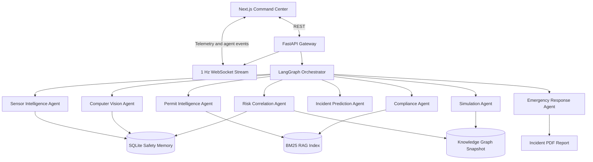

# SentinelAI

SentinelAI is a local-first hackathon MVP for an autonomous industrial safety intelligence platform. It is designed as an AI Chief Safety Officer, not a passive dashboard: eight specialized agents correlate telemetry, CCTV evidence, permit context, safety memory, simulation, compliance, and emergency response into one explainable operational decision.

The centerpiece demo replays a correlated incident where rising hydrogen, an active hot-work permit, worker entry into Zone 3, and missing PPE collapse into one 97% explosion-risk assessment with simulated emergency response.

## Project Statistics

```text
SentinelAI - AI Chief Safety Officer

Tech Stack
- Next.js 15
- React
- TypeScript
- FastAPI
- Python
- Gemini 2.5 Flash
- LangGraph
- SQLite
- Tailwind CSS
- WebSockets
- Playwright
- Vitest
- Pytest

Architecture
- 8 specialized AI agents
- Digital Twin
- Knowledge Graph
- RAG
- Simulation Engine
- Safety Memory
- Emergency Orchestrator

Verification
- Frontend production build
- Backend health/API verification
- 8 backend tests
- 2 frontend tests
- 6 end-to-end tests
- Desktop layout verified
- Mobile layout verified
```

## Run Locally

Requirements: Node.js 20+, Python 3.11+, and Windows PowerShell or Command Prompt.

```bat
setup.cmd
dev.cmd
```

Open `http://localhost:3000`.

The FastAPI service runs at `http://localhost:8000`, with interactive OpenAPI documentation at `http://localhost:8000/docs`.

## Walkthrough

1. Select **Run critical scenario**.
2. Watch hydrogen, permit, worker presence, and PPE evidence raise the Zone 3 risk from 18% to 97%.
3. Open **Incidents** for response actions and the downloadable PDF report.
4. Open **Safety Memory** to inspect the knowledge graph.
5. Open **Simulation** and run the Pump-7 seal failure projection.
6. Open **Compliance** to query indexed safety documents with citations.
7. Ask the voice command bar: `Show me the highest risk area.`

## Implemented vs Simulated

### Implemented

- Multi-agent LangGraph orchestration
- Digital Twin command center UI
- Deterministic risk correlation engine
- 97% correlated explosion-risk incident replay
- Safety Memory persisted in SQLite
- Interactive knowledge graph view
- Local BM25 RAG with page-level citations
- Pump-7 deterministic simulation
- WebSocket telemetry stream
- Voice command interface with typed fallback
- CCTV fixture analysis with known detections
- Emergency response workflow and downloadable incident report
- Storage adapter ports for PostgreSQL, Neo4j, and Qdrant

### Simulated For MVP

- Live SCADA feeds
- Industrial IoT devices
- Real-time CCTV streams
- Drone input and emergency aerial footage
- SMS, phone, email, and emergency dispatch
- Production Kafka streaming
- External PostgreSQL, Neo4j, and Qdrant deployments
- Physics-certified industrial simulation
- Certified legal or regulatory compliance decisions

All calls, dispatches, CCTV detections, drone-style inputs, and emergency actions are simulated. SentinelAI is not certified safety or legal software.

## Architecture Diagram



## Assets

- **CCTV fixture:** `frontend/public/cctv/sentinel-cctv-fixture.png`
- **Sample permit PDF:** `backend/data/sample_permit.pdf`
- **Backend environment example:** `backend/.env.example`
- **Frontend environment example:** `frontend/.env.example`
- **Walkthrough:** use the demo flow above when recording the hackathon video.

## Optional Providers

Set `GEMINI_API_KEY` in `backend/.env` to enrich cited document answers with Gemini. `GEMINI_MODEL` defaults to `gemini-2.5-flash`. Safety scores and emergency triggers always remain deterministic and never depend on model output.

The default demo vision provider recognizes the bundled CCTV fixture. Arbitrary-image inference returns `analysis_unavailable` unless a future Ultralytics provider is enabled.

## Verification

```bat
npm.cmd test
npm.cmd run build
npm.cmd --prefix frontend run test:e2e
```

Expected verification summary:

- Frontend unit tests: 2 passed
- Backend tests: 8 passed
- Playwright desktop/mobile e2e tests: 6 passed
- Production build: passes
