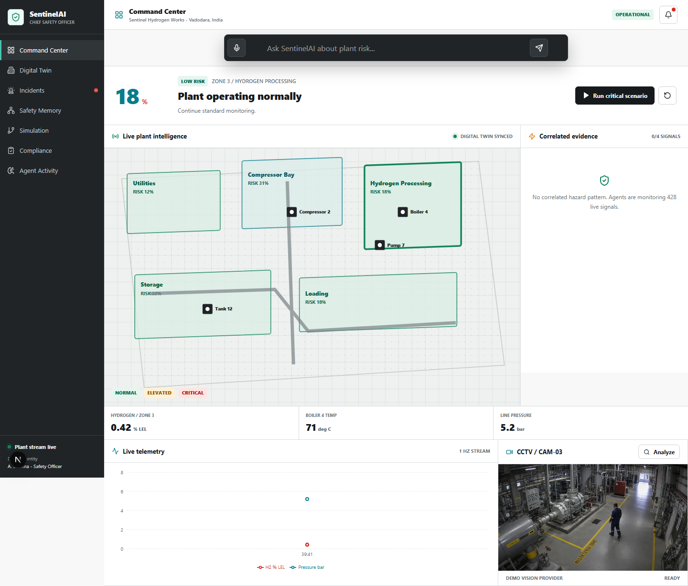

# SentinelAI: Pitch Deck Content

*(Copy this content into your PowerPoint or Google Slides presentation. Keep the text brief and let the visuals do the talking!)*

---

## Slide 1: Title Slide
**Headline:** SentinelAI
**Sub-headline:** The Autonomous AI Chief Safety Officer
**Visual:** 
*A clean, wide screenshot of the SentinelAI Command Center showing the dark-mode map and telemetry sidebar.*
**Footer:** ET AI Hackathon 2.0 | Team [Your Team Name]

---

## Slide 2: The Problem
**Headline:** Industrial Safety operates in isolated silos.
**Bullet Points:**
- **Fragmented Data:** Gas sensors, CCTV feeds, and PDF work permits are disconnected.
- **Cognitive Overload:** Human operators struggle to manually correlate multiple hazard alerts simultaneously.
- **Reactive Response:** Incidents are only addressed *after* alarms trigger, leading to catastrophic accidents.
**Visual:** Three distinct icons: A sensor (beeping), a CCTV camera, and a stack of paper permits—with a big red "X" or barrier between them.

---

## Slide 3: The Solution
**Headline:** SentinelAI: Multi-Agent Safety Correlation
**Bullet Points:**
- **Unified Intelligence:** Fuses telemetry, vision, and context into a single, real-time platform.
- **8-Agent Architecture:** Specialized AI agents handle distinct perception, reasoning, and action tasks.
- **Deterministic Action:** Calculates an "Explosion Risk Score" strictly based on mathematical correlation—zero LLM hallucination risk.
**Visual:** Screenshot of the active "Critical Scenario" showing the risk gauge at 97% and the 4 correlated hazard factors.

---

## Slide 4: Key Innovations
**Headline:** Next-Generation Safety Tech
**Bullet Points:**
- **Safety Memory:** Local Knowledge Graph mapping the relationships between workers, permits, and malfunctioning equipment.
- **Digital Twin:** A spatial Next.js dashboard providing operators with a live facility map.
- **Gemini-Powered Compliance:** Replaces static manuals with an intelligent RAG system that instantly answers and cites regulatory queries.
**Visual:** A split-screen visual. On the left: The Safety Memory Graph. On the right: The Compliance Agent chat answering a question.

---

## Slide 5: Under the Hood (Architecture)
**Headline:** Built for Speed and Scale
**Bullet Points:**
- **Frontend:** Next.js 15, TailwindCSS, 1Hz WebSockets
- **AI Orchestration:** LangGraph, Gemini 2.5 Flash
- **Backend Services:** FastAPI, Python
- **Storage Layer:** SQLite (Graph & Incident Memory), BM25 Vector Search
**Visual:** Paste the Mermaid Architecture Diagram from the README.md here. 

---

## Slide 6: Business Impact
**Headline:** Transforming safety from reactive to proactive.
**Bullet Points:**
- **Prevents Disasters:** Detects multi-factor risk thresholds minutes before an explosion or failure occurs.
- **Automates Compliance:** Instant, accurate retrieval of safety protocols powered by Gemini.
- **Scalable ROI:** Reduces facility downtime, lowers insurance premiums, and protects human lives.
**Visual:** A bold statistic or a simple icon of an upward-trending chart representing safety and efficiency.

---

## Slide 7: Thank You
**Headline:** Ready to Deploy.
**Bullet Points:**
- Live Demo Available
- Q&A
**Visual:** Another polished screenshot of the dashboard or a QR code linking to your GitHub repository.
